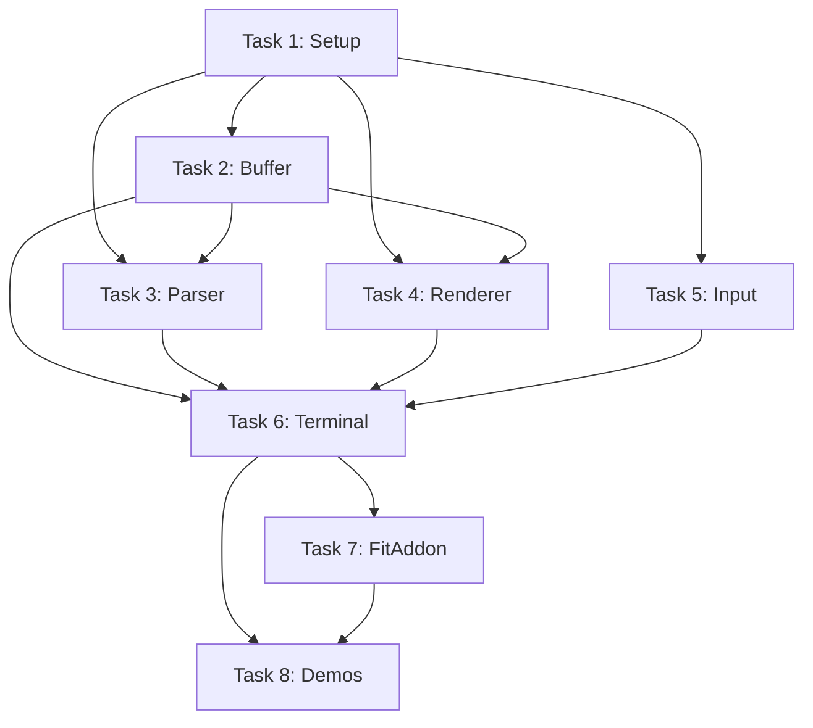

# Ghostty WASM Terminal - Phase 1 MVP Roadmap

## 🎯 Repository Vision

**Build a production-ready web terminal emulator that uses Ghostty's battle-tested VT100 parser via WebAssembly.**

This repository aims to:
1. **Leverage Ghostty's proven parser** - Don't re-implement VT100/ANSI parsing (years of work). Use Ghostty's WASM-compiled parser for colors, escape sequences, and keyboard encoding.
2. **Provide xterm.js-compatible API** - Drop-in replacement for basic xterm.js usage, enabling easy migration for existing projects.
3. **Build the "easy" parts in TypeScript** - Screen buffer, canvas rendering, input handling, and UI logic in modern TypeScript.
4. **Separate concerns** - Ghostty handles the hard parsing (WASM). We handle the visual terminal (TypeScript).

**Why this approach?**
- ✅ Avoid reinventing VT100 parsing (thousands of edge cases, years of bugs)
- ✅ Get Ghostty's correctness and quirk compatibility for free
- ✅ Upstream improvements flow automatically (just rebuild WASM)
- ✅ Focus on rendering and UX instead of parser complexity
- ✅ Modern web stack with TypeScript type safety

---

## Phase 1 Goal

Create a basic terminal emulator with xterm.js-compatible API that can:
- Display text output with ANSI colors/styles
- Accept keyboard input
- Resize terminal dimensions
- Work as drop-in replacement for basic xterm.js usage

**Success criteria**: Can run vim, display colors, handle input, 60 FPS rendering

---

## Configuration Decisions

**✅ Confirmed:**

1. **WASM Build**: Agents build it via `npm run build:wasm` script (auto-clones Ghostty, builds WASM)
2. **Backend**: Local echo terminal for Phase 1 demos
3. **Testing**: **Bun + bun:test** (matching cmux environment)
4. **Package**: `@cmux/ghostty-terminal` (plan for NPM, `private: true` initially)
5. **Browsers**: Chrome 90+ only for Phase 1

---

## Task Breakdown (8 Tasks)

### **Task 1: Project Setup & Build Infrastructure** ⚙️
**Priority: CRITICAL (blocks all others)**  
**Estimated: 3-4 hours**  
**Assignee: Agent A**

Set up project structure, build scripts, and type definitions.

**Files to create:**

#### 1. `package.json`
```json
{
  "name": "@cmux/ghostty-terminal",
  "version": "0.1.0",
  "description": "Terminal emulator using Ghostty's VT100 parser via WASM",
  "type": "module",
  "main": "./dist/index.js",
  "types": "./dist/index.d.ts",
  "exports": {
    ".": {
      "types": "./dist/index.d.ts",
      "default": "./dist/index.js"
    },
    "./addons/fit": {
      "types": "./dist/addons/fit.d.ts",
      "default": "./dist/addons/fit.js"
    }
  },
  "files": [
    "dist/**/*",
    "ghostty-vt.wasm",
    "README.md",
    "LICENSE"
  ],
  "scripts": {
    "build:wasm": "bash scripts/build-wasm.sh",
    "dev": "npm run build:wasm && vite",
    "build": "npm run build:wasm && tsc && vite build",
    "typecheck": "tsc --noEmit",
    "test": "bun test",
    "test:watch": "bun test --watch"
  },
  "keywords": ["terminal", "xterm", "ghostty", "wasm", "vt100"],
  "author": "Coder",
  "license": "AGPL-3.0-only",
  "repository": {
    "type": "git",
    "url": "git+https://github.com/coder/cmux.git",
    "directory": "ghostty-wasm/ghostty"
  },
  "private": true,
  "devDependencies": {
    "@types/bun": "^1.2.23",
    "typescript": "^5.1.3",
    "vite": "^7.1.11"
  },
  "browserslist": [
    "Chrome >= 90"
  ]
}
```

#### 2. `scripts/build-wasm.sh`
```bash
#!/bin/bash
set -e

echo "🔨 Building ghostty-vt.wasm..."

# Check for Zig
if ! command -v zig &> /dev/null; then
    echo "❌ Error: Zig not found"
    echo ""
    echo "Install Zig 0.15.2+:"
    echo "  macOS:   brew install zig"
    echo "  Linux:   https://ziglang.org/download/"
    echo ""
    exit 1
fi

ZIG_VERSION=$(zig version)
echo "✓ Found Zig $ZIG_VERSION"

# Clone/update Ghostty
GHOSTTY_DIR="/tmp/ghostty-for-wasm"
if [ ! -d "$GHOSTTY_DIR" ]; then
    echo "📦 Cloning Ghostty..."
    git clone --depth=1 https://github.com/ghostty-org/ghostty.git "$GHOSTTY_DIR"
else
    echo "📦 Updating Ghostty..."
    cd "$GHOSTTY_DIR"
    git pull --quiet
fi

# Build WASM
cd "$GHOSTTY_DIR"
echo "⚙️  Building WASM (takes ~20 seconds)..."
zig build lib-vt -Dtarget=wasm32-freestanding -Doptimize=ReleaseSmall

# Copy to project root
SCRIPT_DIR="$(cd "$(dirname "${BASH_SOURCE[0]}")" && pwd)"
PROJECT_ROOT="$(dirname "$SCRIPT_DIR")"
cp zig-out/bin/ghostty-vt.wasm "$PROJECT_ROOT/"

SIZE=$(du -h "$PROJECT_ROOT/ghostty-vt.wasm" | cut -f1)
echo "✅ Built ghostty-vt.wasm ($SIZE)"
```

#### 3. `tsconfig.json`
```json
{
  "compilerOptions": {
    "target": "ES2020",
    "module": "ESNext",
    "lib": ["ES2020", "DOM"],
    "moduleResolution": "bundler",
    "resolveJsonModule": true,
    "allowSyntheticDefaultImports": true,
    "esModuleInterop": true,
    "declaration": true,
    "declarationMap": true,
    "sourceMap": true,
    "outDir": "./dist",
    "rootDir": "./lib",
    "strict": true,
    "skipLibCheck": true,
    "forceConsistentCasingInFileNames": true,
    "types": ["bun-types"]
  },
  "include": ["lib/**/*"],
  "exclude": ["node_modules", "dist", "**/*.test.ts"]
}
```

#### 4. `lib/interfaces.ts`
```typescript
/**
 * xterm.js-compatible interfaces
 */

export interface ITerminalOptions {
  cols?: number;                    // Default: 80
  rows?: number;                    // Default: 24
  cursorBlink?: boolean;            // Default: false
  cursorStyle?: 'block' | 'underline' | 'bar';
  theme?: ITheme;
  scrollback?: number;              // Default: 1000
  fontSize?: number;                // Default: 15
  fontFamily?: string;              // Default: 'monospace'
  allowTransparency?: boolean;
}

export interface ITheme {
  foreground?: string;
  background?: string;
  cursor?: string;
  cursorAccent?: string;
  selectionBackground?: string;
  selectionForeground?: string;
  
  // ANSI colors (0-15)
  black?: string;
  red?: string;
  green?: string;
  yellow?: string;
  blue?: string;
  magenta?: string;
  cyan?: string;
  white?: string;
  brightBlack?: string;
  brightRed?: string;
  brightGreen?: string;
  brightYellow?: string;
  brightBlue?: string;
  brightMagenta?: string;
  brightCyan?: string;
  brightWhite?: string;
}

export interface IDisposable {
  dispose(): void;
}

export interface IEvent<T> {
  (listener: (arg: T) => void): IDisposable;
}

export interface ITerminalAddon {
  activate(terminal: ITerminalCore): void;
  dispose(): void;
}

export interface ITerminalCore {
  cols: number;
  rows: number;
  element?: HTMLElement;
  textarea?: HTMLTextAreaElement;
}
```

#### 5. `lib/event-emitter.ts`
```typescript
import type { IEvent, IDisposable } from './interfaces';

export class EventEmitter<T> {
  private listeners: Array<(arg: T) => void> = [];
  
  fire(arg: T): void {
    for (const listener of this.listeners) {
      listener(arg);
    }
  }
  
  event: IEvent<T> = (listener) => {
    this.listeners.push(listener);
    return {
      dispose: () => {
        const index = this.listeners.indexOf(listener);
        if (index >= 0) {
          this.listeners.splice(index, 1);
        }
      }
    };
  };
  
  dispose(): void {
    this.listeners = [];
  }
}
```

#### 6. `.gitignore`
```
node_modules/
dist/
*.wasm
.DS_Store
*.log
.vite/
```

#### 7. `README.md` (basic)
```markdown
# @cmux/ghostty-terminal

Terminal emulator using Ghostty's VT100 parser via WebAssembly.

## Development

\`\`\`bash
bun install
bun run build:wasm  # Build ghostty-vt.wasm
bun run dev         # Start dev server
bun test            # Run tests
\`\`\`

## Usage

\`\`\`typescript
import { Terminal } from '@cmux/ghostty-terminal';

const term = new Terminal({ cols: 80, rows: 24 });
await term.open(document.getElementById('terminal'));
term.write('Hello World\\r\\n');
\`\`\`

## License

AGPL-3.0-only
```

**Testing:**
- [ ] `bun install` succeeds
- [ ] `bun run build:wasm` builds WASM file
- [ ] `ghostty-vt.wasm` exists and is ~122 KB
- [ ] TypeScript compiles without errors
- [ ] `bun test` runs (no tests yet, but setup works)

---

### **Task 2: Screen Buffer** 📊
**Priority: High (needed by Tasks 3, 4)**  
**Estimated: 5-6 hours**  
**Assignee: Agent B**  
**Depends on: Task 1**

Implement the 2D grid that holds terminal content.

**File to create:** `lib/buffer.ts`

**Key classes:**
```typescript
export type CellColor = 
  | { type: 'default' }
  | { type: 'palette'; index: number }
  | { type: 'rgb'; r: number; g: number; b: number };

export interface Cell {
  char: string;
  width: number;  // 1 or 2 for wide chars
  fg: CellColor;
  bg: CellColor;
  bold: boolean;
  italic: boolean;
  underline: boolean;
  inverse: boolean;
  invisible: boolean;
  strikethrough: boolean;
  faint: boolean;
  blink: boolean;
}

export class ScreenBuffer {
  private lines: Cell[][];
  private cursor: Cursor;
  private savedCursor: Cursor | null = null;
  private scrollback: Cell[][] = [];
  private cols: number;
  private rows: number;
  private maxScrollback: number;
  
  constructor(cols: number, rows: number, scrollback = 1000);
  
  // Core methods
  writeChar(char: string): void;
  moveCursorTo(x: number, y: number): void;
  moveCursorUp(n: number): void;
  moveCursorDown(n: number): void;
  moveCursorForward(n: number): void;
  moveCursorBackward(n: number): void;
  
  scrollUp(n: number): void;
  scrollDown(n: number): void;
  
  eraseInLine(mode: 0 | 1 | 2): void;
  eraseInDisplay(mode: 0 | 1 | 2): void;
  
  insertLines(n: number): void;
  deleteLines(n: number): void;
  insertChars(n: number): void;
  deleteChars(n: number): void;
  
  saveCursor(): void;
  restoreCursor(): void;
  
  resize(newCols: number, newRows: number): void;
  
  getLine(y: number): Cell[];
  getAllLines(): Cell[][];
  getScrollback(): Cell[][];
  getCursor(): Cursor;
  
  setStyle(style: Partial<CellStyle>): void;
  resetStyle(): void;
}
```

**Test file:** `lib/buffer.test.ts`
```typescript
import { describe, test, expect } from 'bun:test';
import { ScreenBuffer } from './buffer';

describe('ScreenBuffer', () => {
  test('writes characters at cursor position', () => {
    const buffer = new ScreenBuffer(80, 24);
    buffer.writeChar('H');
    buffer.writeChar('i');
    
    const line = buffer.getLine(0);
    expect(line[0].char).toBe('H');
    expect(line[1].char).toBe('i');
  });
  
  test('wraps to next line at right edge', () => {
    const buffer = new ScreenBuffer(3, 24);
    buffer.writeChar('A');
    buffer.writeChar('B');
    buffer.writeChar('C');
    buffer.writeChar('D'); // Should wrap
    
    expect(buffer.getCursor().y).toBe(1);
    expect(buffer.getLine(1)[0].char).toBe('D');
  });
  
  test('scrolls when reaching bottom', () => {
    const buffer = new ScreenBuffer(80, 3);
    for (let i = 0; i < 4; i++) {
      buffer.moveCursorTo(0, Math.min(i, 2));
      buffer.writeChar(String(i));
      if (i < 3) buffer.moveCursorTo(0, i + 1);
    }
    
    const scrollback = buffer.getScrollback();
    expect(scrollback.length).toBeGreaterThan(0);
  });
  
  // Add tests for: erasing, cursor movement, resize, etc.
});
```

---

### **Task 3: VT100 State Machine** 🔀
**Priority: High (core functionality)**  
**Estimated: 8-10 hours**  
**Assignee: Agent C**  
**Depends on: Task 1, Task 2**

Parse ANSI/VT100 escape sequences and update buffer.

**File to create:** `lib/vt-parser.ts`

**Critical requirement:** Use Ghostty SgrParser for colors
```typescript
import { Ghostty, SgrAttributeTag } from './ghostty';
import { ScreenBuffer } from './buffer';

enum ParserState {
  GROUND,
  ESCAPE,
  CSI_ENTRY,
  CSI_PARAM,
  CSI_FINAL,
  OSC_STRING,
  DCS_ENTRY,
}

export class VTParser {
  private state: ParserState = ParserState.GROUND;
  private params: number[] = [];
  private sgrParser: SgrParser;
  
  constructor(
    private buffer: ScreenBuffer,
    ghostty: Ghostty
  ) {
    this.sgrParser = ghostty.createSgrParser();
  }
  
  parse(data: string): void {
    for (const char of data) {
      this.processChar(char);
    }
  }
  
  private handleSGR(params: number[]): void {
    if (params.length === 0) params = [0];
    
    for (const attr of this.sgrParser.parse(params)) {
      switch (attr.tag) {
        case SgrAttributeTag.BOLD:
          this.currentStyle.bold = true;
          break;
        case SgrAttributeTag.FG_RGB:
          this.currentStyle.fg = {
            type: 'rgb',
            r: attr.color.r,
            g: attr.color.g,
            b: attr.color.b
          };
          break;
        // ... handle ALL SGR tags from types.ts
      }
    }
    this.buffer.setStyle(this.currentStyle);
  }
}
```

**Sequences to support:**
- Control characters: `\n`, `\r`, `\t`, `\b`, `\x07`
- Cursor movement: `ESC[A` (up), `ESC[B` (down), `ESC[C` (forward), `ESC[D` (back), `ESC[H` (home)
- Erasing: `ESC[J` (display), `ESC[K` (line)
- SGR colors: `ESC[...m` (use Ghostty SgrParser)
- Cursor save/restore: `ESC[s`, `ESC[u`

**Test file:** `lib/vt-parser.test.ts`
```typescript
import { describe, test, expect, beforeAll } from 'bun:test';
import { VTParser } from './vt-parser';
import { ScreenBuffer } from './buffer';
import { Ghostty } from './ghostty';

describe('VTParser', () => {
  let buffer: ScreenBuffer;
  let parser: VTParser;
  
  beforeAll(async () => {
    const ghostty = await Ghostty.load('./ghostty-vt.wasm');
    buffer = new ScreenBuffer(80, 24);
    parser = new VTParser(buffer, ghostty);
  });
  
  test('parses plain text', () => {
    parser.parse('Hello');
    expect(buffer.getLine(0)[0].char).toBe('H');
  });
  
  test('parses ANSI colors', () => {
    parser.parse('\x1b[31mRed\x1b[0m');
    const cell = buffer.getLine(0)[0];
    expect(cell.fg.type).toBe('palette');
  });
  
  // Add more tests...
});
```

---

### **Task 4: Canvas Renderer** 🎨
**Priority: High (visual output)**  
**Estimated: 6-8 hours**  
**Assignee: Agent D**  
**Depends on: Task 1, Task 2**

Draw the terminal buffer to canvas.

**File to create:** `lib/renderer.ts`

**Key features:**
- Measure font metrics
- Dirty line tracking (performance)
- Render cells with colors, bold, italic, underline
- Render cursor (block/bar/underline)
- Support 256-color palette and RGB

**Default theme:**
```typescript
export const DEFAULT_THEME = {
  foreground: '#d4d4d4',
  background: '#1e1e1e',
  cursor: '#ffffff',
  black: '#000000',
  red: '#cd3131',
  green: '#0dbc79',
  yellow: '#e5e510',
  blue: '#2472c8',
  magenta: '#bc3fbc',
  cyan: '#11a8cd',
  white: '#e5e5e5',
  brightBlack: '#666666',
  brightRed: '#f14c4c',
  brightGreen: '#23d18b',
  brightYellow: '#f5f543',
  brightBlue: '#3b8eea',
  brightMagenta: '#d670d6',
  brightCyan: '#29b8db',
  brightWhite: '#ffffff',
};
```

**Test file:** `lib/renderer.test.ts`
```typescript
import { describe, test, expect } from 'bun:test';
import { CanvasRenderer } from './renderer';

describe('CanvasRenderer', () => {
  test('measures font correctly', () => {
    // Test font measurement
  });
  
  test('renders dirty lines only', () => {
    // Test dirty rectangle optimization
  });
  
  // Note: Visual rendering is hard to unit test
  // Main testing will be manual/visual
});
```

---

### **Task 5: Input Handler** ⌨️
**Priority: High (interactivity)**  
**Estimated: 6-8 hours**  
**Assignee: Agent E**  
**Depends on: Task 1**

Convert keyboard events to terminal input using Ghostty KeyEncoder.

**File to create:** `lib/input-handler.ts`

**Critical:** Complete key mapping table
```typescript
const KEY_MAP: Record<string, Key> = {
  'KeyA': Key.A,
  'KeyB': Key.B,
  // ... A-Z (all 26 letters)
  'Digit0': Key.ZERO,
  // ... 0-9
  'Enter': Key.ENTER,
  'Escape': Key.ESCAPE,
  'Backspace': Key.BACKSPACE,
  'Tab': Key.TAB,
  'Space': Key.SPACE,
  'ArrowUp': Key.UP,
  'ArrowDown': Key.DOWN,
  'ArrowLeft': Key.LEFT,
  'ArrowRight': Key.RIGHT,
  'F1': Key.F1,
  // ... F1-F12, Home, End, PageUp, PageDown, Insert, Delete
};
```

**Test file:** `lib/input-handler.test.ts`
```typescript
import { describe, test, expect, beforeAll } from 'bun:test';
import { InputHandler } from './input-handler';
import { Ghostty } from './ghostty';

describe('InputHandler', () => {
  let handler: InputHandler;
  let dataReceived: string[] = [];
  
  beforeAll(async () => {
    const ghostty = await Ghostty.load('./ghostty-vt.wasm');
    const container = document.createElement('div');
    handler = new InputHandler(
      ghostty,
      container,
      (data) => dataReceived.push(data),
      () => {}
    );
  });
  
  test('encodes printable characters', () => {
    // Test key encoding
  });
  
  test('encodes Ctrl+A', () => {
    // Test modifier keys
  });
});
```

---

### **Task 6: Terminal Class (Integration)** 🔗
**Priority: CRITICAL (glues everything)**  
**Estimated: 8-10 hours**  
**Assignee: Agent F**  
**Depends on: Tasks 1-5**

Create main Terminal class with xterm.js-compatible API.

**Files to create:**
- `lib/terminal.ts` - Main Terminal class
- `lib/index.ts` - Public API exports

**Key methods:**
```typescript
export class Terminal implements ITerminalCore {
  async open(parent: HTMLElement): Promise<void>
  write(data: string | Uint8Array): void
  writeln(data: string): void
  resize(cols: number, rows: number): void
  clear(): void
  reset(): void
  focus(): void
  loadAddon(addon: ITerminalAddon): void
  dispose(): void
  
  // Events
  readonly onData: IEvent<string>
  readonly onResize: IEvent<{ cols: number; rows: number }>
  readonly onBell: IEvent<void>
}
```

**Entry point (`lib/index.ts`):**
```typescript
export { Terminal } from './terminal';
export type { ITerminalOptions, ITheme, ITerminalAddon } from './interfaces';
export { Ghostty, SgrParser, KeyEncoder } from './ghostty';
export type { 
  SgrAttribute, 
  SgrAttributeTag, 
  KeyEvent, 
  KeyAction, 
  Key, 
  Mods 
} from './types';
```

**Test file:** `lib/terminal.test.ts`
```typescript
import { describe, test, expect } from 'bun:test';
import { Terminal } from './terminal';

describe('Terminal', () => {
  test('creates terminal with default size', () => {
    const term = new Terminal();
    expect(term.cols).toBe(80);
    expect(term.rows).toBe(24);
  });
  
  // Add integration tests
});
```

---

### **Task 7: FitAddon** 📐
**Priority: Medium (useful utility)**  
**Estimated: 2-3 hours**  
**Assignee: Agent G**  
**Depends on: Task 6**

Auto-resize terminal to container.

**File to create:** `lib/addons/fit.ts`

**Usage:**
```typescript
const fitAddon = new FitAddon();
term.loadAddon(fitAddon);
fitAddon.fit();
fitAddon.observeResize(); // Auto-fit on container resize
```

**Test file:** `lib/addons/fit.test.ts`
```typescript
import { describe, test, expect } from 'bun:test';
import { FitAddon } from './fit';

describe('FitAddon', () => {
  test('resizes terminal to fit container', async () => {
    // Test resizing logic
  });
});
```

---

### **Task 8: Demos & Documentation** 📚
**Priority: Medium (validation)**  
**Estimated: 4-5 hours**  
**Assignee: Agent H**  
**Depends on: Task 6, Task 7**

Create working demos and API documentation.

**Files to create:**
1. `examples/basic-terminal.html` - Echo terminal with input
2. `examples/colors-demo.html` - ANSI color showcase
3. `docs/API.md` - API documentation

**Testing checklist:**
- [ ] `bun run build` succeeds
- [ ] Basic terminal works (type, echo, backspace)
- [ ] Colors demo shows all colors correctly
- [ ] FitAddon resizes terminal properly
- [ ] No console errors in Chrome DevTools

---

## Testing Strategy

### Unit Tests (Bun)
- Task 2: ScreenBuffer tests
- Task 3: VTParser tests
- Task 4: Renderer tests
- Task 5: InputHandler tests
- Task 6: Terminal integration tests
- Task 7: FitAddon tests

Run: `bun test` or `bun test --watch`

### Manual Testing
- [ ] Basic terminal demo works
- [ ] Colors render correctly
- [ ] Terminal resizes with FitAddon
- [ ] 60 FPS rendering

---

## Success Criteria

MVP is complete when:
1. ✅ All 8 tasks implemented
2. ✅ Unit tests passing (`bun test`)
3. ✅ Both demos work in Chrome
4. ✅ Can type and see output
5. ✅ Colors render correctly
6. ✅ FitAddon works
7. ✅ No visual glitches
8. ✅ 60 FPS rendering

---

## Timeline

**Week 1:**
- Day 1: Task 1 (setup)
- Day 2-3: Task 2 (buffer)
- Day 2-4: Task 3 (parser)

**Week 2:**
- Day 5-7: Task 4 (renderer)
- Day 5-7: Task 5 (input)

**Week 3:**
- Day 8-10: Task 6 (terminal)
- Day 11: Task 7 (fit addon)
- Day 12-13: Task 8 (demos)

**Total: ~3 weeks with 2-3 agents working in parallel**

---

## Dependencies Graph



---

## Out of Scope (Phase 2)

Not included in MVP:
- ❌ Text selection with mouse
- ❌ Copy to clipboard
- ❌ Scrollback navigation UI
- ❌ Mouse tracking
- ❌ Search functionality
- ❌ WebSocket PTY connection
- ❌ Link detection
- ❌ Image rendering
- ❌ Ligatures
- ❌ Accessibility

---

## Key Technical Decisions

1. **Bun + bun:test** for testing (matches cmux environment)
2. **Chrome-only** for Phase 1
3. **Canvas rendering** for performance
4. **Ghostty WASM** for VT100 parsing
5. **xterm.js API compatibility**
6. **TypeScript** with strict mode
7. **Vite** for bundling
8. **Echo terminal** for demos

---

## Ready to Start!

All decisions finalized:
- ✅ Package: `@cmux/ghostty-terminal`
- ✅ Testing: **Bun + bun:test**
- ✅ Build: Automated WASM script
- ✅ Browser: Chrome 90+
- ✅ Backend: Echo terminal

**Next step:** Assign tasks to agents!
